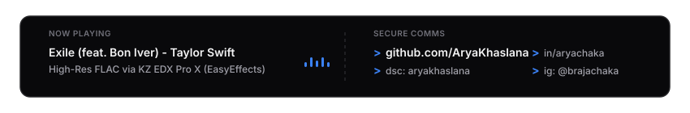

---

  

---

  

---

  

---

### 📈 Contribution Pacman

<picture>
  <source media="(prefers-color-scheme: dark)" srcset="https://raw.githubusercontent.com/AryaKhaslana/AryaKhaslana/output/pacman-contribution-graph-dark.svg">
  <source media="(prefers-color-scheme: light)" srcset="https://raw.githubusercontent.com/AryaKhaslana/AryaKhaslana/output/pacman-contribution-graph.svg">
  
</picture>

---

  

---

  

